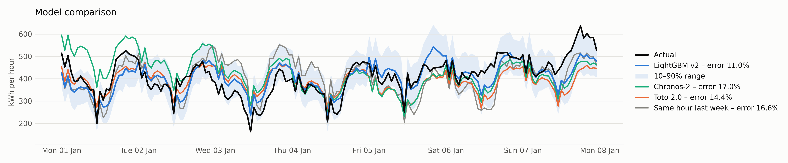

# Bringing the Heat — Hackathon Summary

[Repository](https://github.com/3LL3RM4NN/rwth_hackathon)

A single pipeline covering Levels 0–3 of the brief, run in order:

1. **PV-pattern detection** (`src/pv_features.py`, `src/pv_detection.py`) — a
   `HistGradientBoostingClassifier` on hand-built seasonal/midday-suppression features,
   validated out-of-fold against the 245 surveyed households (**0.937 ROC AUC, 89.4%
   accuracy**), then used to label the 165 unsurveyed households so they can join a
   forecasting group too.
2. **Grouped 15-minute aggregation** (`src/aggregate.py`) — PV (158 households), No-PV
   (252) and all-households (410) consumption series at native 15-min resolution, with
   weather upsampled from hourly via time-based linear interpolation. The target is each
   group's **per-household average**, not its raw sum, which is far more stable across
   the meter-rollout ramp-up and recovers 1–2 extra years of usable history.
3. **Day-ahead forecasting** (`src/forecast.py`) — one `LGBMRegressor` per group,
   predicting all 96 15-minute steps of the next day from a single, realistic
   **11:45 AM gate-closure cutoff** the day before delivery (never midnight, never
   same-day weather actuals). Plus two `objective="quantile"` models per group for a
   nominal 90% prediction interval (Level 3).
4. **Level 2 check: did grouping actually help?** — PV and No-PV predictions rescaled
   back to kWh totals and summed per 15-min step (not by naively adding each group's own
   MAE, which overstates the error), then compared against one ungrouped model on the
   same test window.

### Headline results (shared test window, 2023-09-05 → 2024-02-27)

| Segment | MAPE |
|---|---|
| PV group | 21.6% |
| No-PV group | 11.8% |
| All-households, ungrouped | 12.9% |
| **Grouped, portfolio-wide** | **12.6%** | 

Grouping beats the single ungrouped model on every metric (MAE 16.45 vs 16.64 kWh/15min,
MAPE 12.6% vs 12.9%), and the PV/No-PV split exposes an 9.8-point MAPE gap the pooled
model hides entirely — useful for procurement risk management on its own. On
**uncertainty**, the 90% prediction intervals are honestly overconfident (realised
coverage, PICP, is 74–85% against a 90% nominal target, worst for the noisier PV group)
— reported as a real calibration gap, not tuned away.

## Previous evaluation of different models

Before settling on the LightGBM approach above, a wider model sweep was
run across tree, deep-learning, foundation (zero-shot) and naive-baseline families, 
scored on portfolio-level normalized MAE (`port_nMAE_%`) and daily/household MAE:

| Model | Family | Track | Port MAE (kWh) | Port nMAE % | Coverage 10–90 |
|---|---|---|---:|---:|---:|
| LightGBM_W0_v2 | tree (v2) | W0 | 39.72 | **14.07** | 0.765 |
| CatBoost_W0_v2 | tree (v2) | W0 | 39.87 | 14.12 | 0.770 |
| CatBoost_W0 | tree | W0 | 40.32 | 14.28 | 0.766 |
| Ensemble_W0 | ensemble | W0 | 40.65 | 14.40 | 0.765 |
| LightGBM_W0 | tree | W0 | 40.95 | 14.51 | 0.771 |
| HGB_W0 | tree | W0 | 41.16 | 14.58 | 0.762 |
| Toto2_target-only | foundation (zero-shot) | target-only | 42.00 | 14.88 | 0.775 |
| PatchTST_target-only | deep (trained) | target-only | 42.93 | 15.21 | 0.775 |
| Blend | baseline | target-only | 44.31 | 15.70 | 0.778 |
| Chronos2_W0 | foundation (zero-shot) | W0 | 47.84 | 16.95 | 0.762 |
| NHITS_W0 | deep (trained) | W0 | 49.30 | 17.46 | 0.765 |
| B3_weekmean | baseline | target-only | 45.60 | 16.15 | 0.777 |
| B2_twodays | baseline | target-only | 48.31 | 17.11 | 0.778 |
| TFT_W0 | deep (trained) | W0 | 56.74 | 20.10 | 0.749 |
| B1_lastweek | baseline | target-only | 57.66 | 20.42 | 0.767 |

**Takeaway:** gradient-boosted trees (LightGBM/CatBoost, with weather + calendar
features, track "W0") win outright — foundation zero-shot models (Chronos-2, Toto 2.0)
and trained deep nets (NHITS, TFT, PatchTST) all trail, and every naive baseline is
worse still. This is consistent with (and part of the reason behind) the LightGBM/
CatBoost choice used in the pipeline above. `week_strict_chronos_compact.png` below
shows one illustrative week of this comparison:

LightGBM (blue, 11.0% error) tracks the actual portfolio load (black) markedly closer
than the zero-shot foundation models or the naive same-hour-last-week baseline (grey,
16.6% error), especially around the sharp weekday troughs — the same persistence-style
signal the feature-ablation study in `reports/report.md` identifies as the dominant
driver of model accuracy.

## Outlook: portfolio-level modeling (`PORTFOLIO_MODEL.md`, branch `johannes_l2`)

A parallel branch explores training directly on the **portfolio total** instead of
per-household series:

1. **Forecast target** — this repo's models predict each group's per-household average
   (effectively household-level); the portfolio model instead predicts **only the total
   portfolio load** directly.
2. **Training objective** — rather than learning and aggregating household-level
   errors, it directly minimizes the squared error of the portfolio total itself,
   Σ(d,h) (Y[d,h] − Ŷ[d,h])², over θ.
3. **Trade-off** — household-level modeling (this branch's approach) keeps individual
   forecasts and flexibility (e.g. the PV-vs-No-PV risk breakdown above); direct
   portfolio modeling drops that granularity in exchange for optimizing exactly the
   number a day-ahead procurement desk actually bids on.

Combining the two is a natural next step: use the grouped/per-household approach for
risk characterization (where does forecast error concentrate?) and a direct
portfolio-objective model for the bid number itself, then compare them on the same
portfolio-wide metrics this report already uses.
